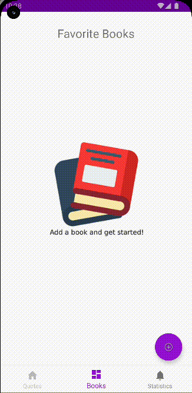

# crimson

#### An Android app that can help readers to extract & organize their favorite quotes

  

##### The user can take a photo of a page, crop the interesting quote and extract it using the built-in OCR & language detection APIs of Android
##### The app makes use of OpenLibrary to gather information about books & covers
##### The data is stored on the device and supports backup through an export/import mechanism
##### The app is a prototype created for personal use: unfortunately, I switched to iOS, so it's no longer improved and maintained 😿
